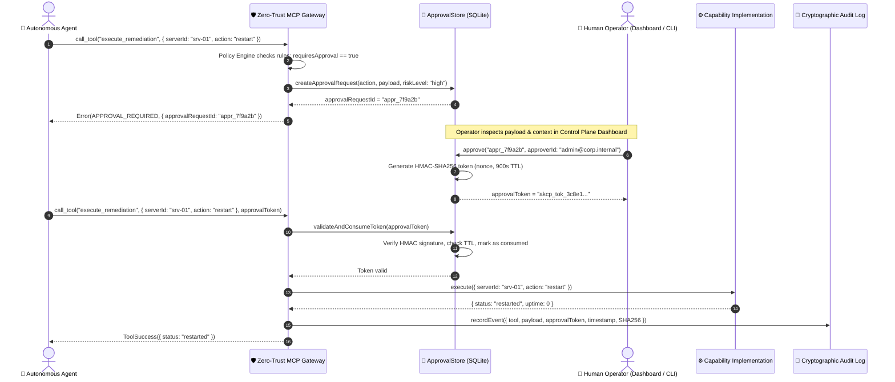

# Human-in-the-Loop (HITL) Security Architecture

The Agent Knowledge Compiler and Control Plane (AKCP) strictly enforces a **Human-in-the-Loop (HITL)** governance architecture for all mutating, high-risk, or non-idempotent operations.

In autonomous multi-agent environments, agents attempting unconstrained tool execution pose severe risks of cascading failures, unauthorized resource modification, and policy violations. AKCP intercepts side-effecting operations at the Zero-Trust Gateway before any execution takes place.

---

## 1. Core Security Principles

1. **No Silent State Changes**: Any action that alters external systems (e.g. database updates, payment submissions, cloud provisioning, destructive shell scripts) requires explicit human confirmation.
2. **Two-Step Execution Protocol**:
   - **Step 1: Preparation & Gating**: The agent invokes a tool. The Zero-Trust Gateway evaluates attached Policy Cards. If `requiresApproval: true` or `sideEffect: destructive`, execution halts and an `approvalRequestId` is registered in the SQLite `ApprovalStore`. The gateway returns an `APPROVAL_REQUIRED` status to the agent.
   - **Step 2: Authorization & Token Verification**: A human operator reviews the action, arguments, and context. Upon authorization, an HMAC-signed token is issued. The agent re-invokes the capability presenting the token to execute.
3. **Cryptographic Signatures**: Tokens are signed using HMAC-SHA256 over the action name, target payload hash, and issue timestamp.
4. **Time-Limited TTL**: Tokens automatically expire after a configurable window (default: 15 minutes / 900 seconds) to prevent stale action replays.
5. **Strict Single-Use Invalidation**: Once consumed by the gateway during execution, tokens are immediately invalidated in SQLite transactions to prevent replay attacks.
6. **Immutable Audit Trail**: All requests, human approvals, denials, and downstream execution payloads are cryptographically hashed and written to the append-only Evidence Store.

---

## 2. Cryptographic Approval Lifecycle



---

## 3. Threat Mitigation Matrix

This architecture directly addresses the **OWASP Top 10 for Agentic Applications (2026)**:

| Threat Category                         | Vulnerability                                                    | AKCP Mitigation                                                                                     |
| --------------------------------------- | ---------------------------------------------------------------- | --------------------------------------------------------------------------------------------------- |
| **ASI02: Tool Misuse & Exploitation**   | Agents executing unvetted or destructive parameters.             | Gateways intercept calls and enforce human approval on all destructive operations.                  |
| **ASI03: Identity and Privilege Abuse** | Rogue agents escalating privileges beyond policy scope.          | Capabilities are scoped to domain Policy Cards; high-risk actions require independent human tokens. |
| **ASI08: Cascading Failures**           | Automated loops triggering compounding errors in infrastructure. | Human checkpoints break infinite automated failure loops before mutations spread.                   |

---

## 4. Operator Interfaces

Operators can inspect and manage pending approvals through two official interfaces:

### Web Dashboard & BFF

The Control Plane Dashboard (served locally via `akcp quickstart` or `akcp serve dashboard` at `http://localhost:3001`) provides an interactive queue:

- Inspect agent ID, requested tool, full JSON payload, and risk classification.
- Click **Approve** or **Reject** with optional operator notes.
- Real-time SSE updates notify the UI when new requests arrive.

### Command-Line Interface (CLI)

For headless environments or CI/CD pipelines:

```bash
# List all pending approval requests
akcp control-plane approvals

# Inspect detailed runtime governance and policies
akcp control-plane inspect

# Review cryptographic audit log entries
akcp control-plane audit
```
