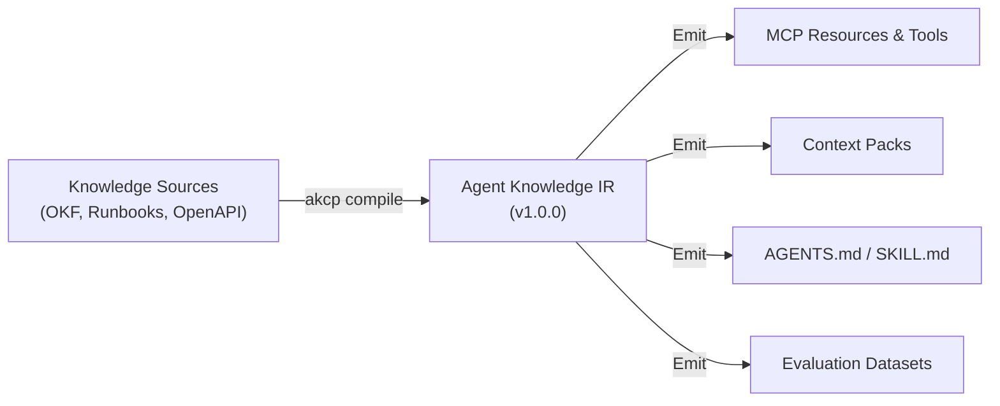

# Agent Knowledge Intermediate Representation (AK-IR) Specification

**Version**: `1.0.0`  
**Status**: Stable / Standard  
**MIME Type**: `application/json`  
**Schema Reference**: [`packages/core/src/ir/schema.ts`](../../packages/core/src/ir/schema.ts)

---

## 1. Overview

The **Agent Knowledge Intermediate Representation (AK-IR)** is a normalized, strongly-typed JSON schema that represents the compiled state of an organizational knowledge bundle.

AK-IR acts as the universal AST (Abstract Syntax Tree) bridging heterogeneous knowledge sources (Google Cloud OKF, generic Markdown runbooks, OpenAPI endpoints, wikis) with runtime delivery targets (MCP profile/automation servers, Context Packs, OpenWiki document structures, agent instructions, and eval datasets).



---

## 2. Envelope Specification

An AK-IR document is a single JSON object conforming to the following structure:

```json
{
  "irVersion": "1.0.0",
  "okfVersion": "0.2.0",
  "bundleId": "it-operations",
  "buildId": "bld_a1b2c3d4",
  "timestamp": "2026-09-08T14:00:00.000Z",
  "concepts": [],
  "links": [],
  "policies": {},
  "capabilities": [],
  "targets": ["context-pack", "mcp-resources", "openwiki"],
  "sourceHashes": {}
}
```

### Top-Level Fields

| Field          | Type                     | Required | Description                                                                                      |
| :------------- | :----------------------- | :------: | :----------------------------------------------------------------------------------------------- |
| `irVersion`    | `string`                 | **Yes**  | Specification version of the intermediate representation (currently `1.0.0`).                    |
| `okfVersion`   | `string`                 | **Yes**  | The source Open Knowledge Format version declared in `index.md` (e.g. `0.2.0` or `unspecified`). |
| `bundleId`     | `string`                 | **Yes**  | Unique identifier for the compiled knowledge bundle.                                             |
| `buildId`      | `string`                 | **Yes**  | Ephemeral, build-unique identifier generated per compilation run (`bld_<uuid>`).                 |
| `timestamp`    | `string`                 | **Yes**  | ISO-8601 UTC timestamp of the compilation run.                                                   |
| `concepts`     | `Array<Concept>`         | **Yes**  | Array of normalized knowledge concepts extracted from source documents.                          |
| `links`        | `Array<Link>`            |    No    | Semantic relationship edges connecting concepts into a directed graph.                           |
| `policies`     | `Object`                 |    No    | Governance configuration, autonomy levels, and PII mode rules.                                   |
| `capabilities` | `Array<Capability>`      |    No    | Registered tools, resources, and prompts declared for agent interaction.                         |
| `targets`      | `Array<string>`          |    No    | List of compile targets enabled in `akcp.yaml` (e.g., `mcp-resources`).                          |
| `sourceHashes` | `Record<string, string>` |    No    | Map of source file relative paths to their SHA-256 content hashes.                               |

---

## 3. Core Objects

### 3.1 `Concept` Object

Represents a single atomic unit of knowledge (e.g., runbook, policy card, architecture doc, skill).

```json
{
  "conceptId": "runbooks/high-cpu",
  "type": "Runbook",
  "source": {
    "filePath": "sources/runbooks/high-cpu.md",
    "format": "okf/markdown",
    "hash": "e3b0c44298fc1c149afbf4c8996fb92427ae41e4649b934ca495991b7852b855"
  },
  "frontmatter": {
    "title": "High CPU Incident Remediation",
    "tags": ["cpu", "incident", "kubernetes"],
    "sloImpact": "latency-p99"
  },
  "body": "## Immediate Actions\n1. Inspect top pods using kubectl top...\n",
  "budget": {
    "byteSize": 1240,
    "estimatedTokens": 310
  },
  "provenance": {
    "conceptId": "runbooks/high-cpu",
    "sourceFile": "sources/runbooks/high-cpu.md",
    "sourceHash": "e3b0c44298fc1c149afbf4c8996fb92427ae41e4649b934ca495991b7852b855",
    "timestamp": "2026-09-08T14:00:00.000Z"
  },
  "status": "active",
  "isStale": false
}
```

- **`conceptId`**: Unique relative identifier, path-traversal sanitized (never contains `..`).
- **`budget`**: Character byte count and estimated BPE token count (~4 chars/token heuristic).
- **`provenance`**: Cryptographic link tying the compiled concept to its raw source file hash.
- **`status`**: Lifecycle state (`active`, `stale`, `deprecated`, `archived`).

### 3.2 `Link` Object

Represents a directed dependency or cross-reference between two concepts.

```json
{
  "sourceConceptId": "runbooks/high-cpu",
  "targetConceptId": "services/auth-api",
  "relationType": "applies_to"
}
```

Supported relation types: `applies_to`, `depends_on`, `references`, `replaces`, `relates_to`.

### 3.3 `Capability` Object

Defines an executable MCP tool, resource, or prompt governing agent actions.

```json
{
  "id": "it-operations.restart_service",
  "kind": "tool",
  "name": "restart_service",
  "description": "Restarts a target service replica in Kubernetes.",
  "owner": "platform-engineering",
  "version": "1.0.0",
  "riskLevel": "critical",
  "sideEffects": "external-submit",
  "requiresApproval": true,
  "readsPII": false,
  "writesPII": false,
  "inputsSchema": {
    "type": "object",
    "properties": {
      "serviceName": { "type": "string" },
      "environment": { "type": "string" }
    },
    "required": ["serviceName", "environment"]
  },
  "policyRefs": ["policies/restart_service.policy.yaml"]
}
```

- **`riskLevel`**: Classification (`low`, `medium`, `high`, `critical`).
- **`sideEffects`**: Execution impact classification:
  - `none`: Pure calculation or offline read.
  - `local-write`: Mutates local state / cache.
  - `external-read`: Network read (API, DB query).
  - `external-write`: Non-destructive mutation (create draft, send staging event).
  - `external-submit`: Destructive / real-world side effect (deploy, execute financial transaction, delete resource).
- **`requiresApproval`**: Triggers Human-In-The-Loop two-phase commit gating.

---

## 4. Verification and Conformance

AK-IR validation is performed in the compiler pipeline via Zod (`AgentKnowledgeIRSchema.safeParse(ir)`). An IR artifact must:

1. Pass complete schema validation with no type coercion errors.
2. Contain zero broken cycles in deprecated successor documents (`LifecycleValidator`).
3. Guarantee that all side-effecting capabilities (`local-write`, `external-write`, `external-submit`) declare risk levels and approval requirements (`CapabilityValidator`).
